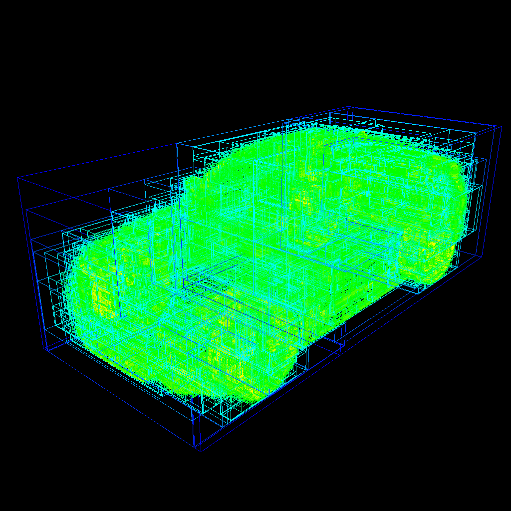
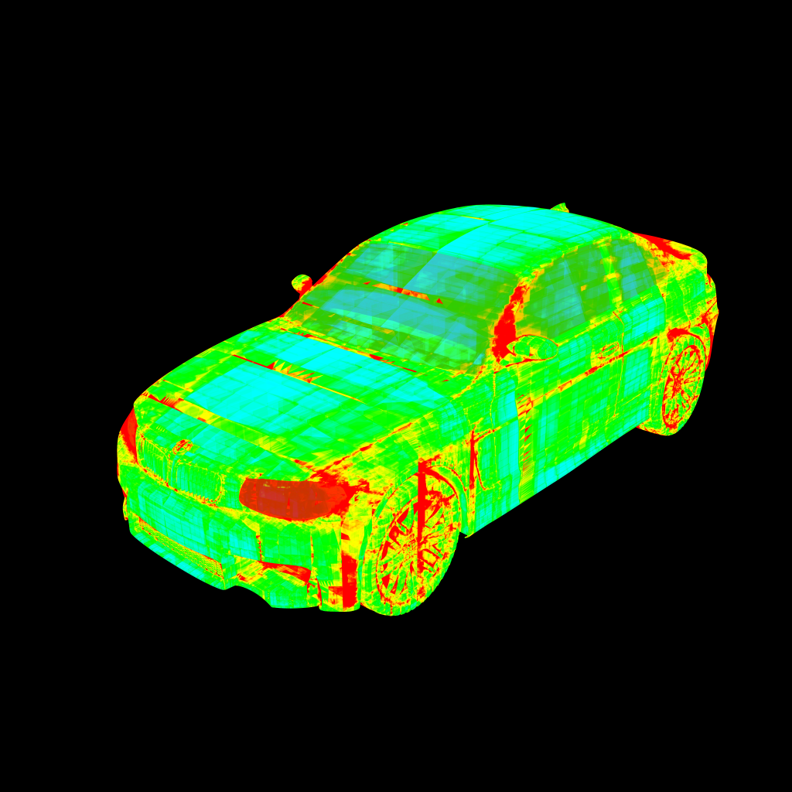
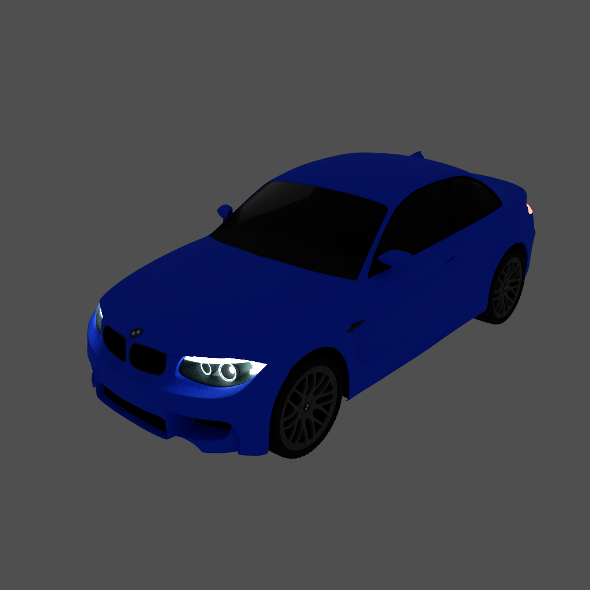

# Gallery

## BVH Debug

The image below will be used as the reference image for the BVH debug images.

    

        
    

    
BMW car model courtesy of Mike Pan and Morgan McGuire, license CC0/Public Domain. (Model downloaded from Morgan McGuire's Computer Graphics Archive https://casual-effects.com/data.)
 

### BVH Bounds

#### Layer

    

        
    

    
BMW car model courtesy of Mike Pan and Morgan McGuire, license CC0/Public Domain. (Model downloaded from Morgan McGuire's Computer Graphics Archive https://casual-effects.com/data.)
 
    
Layer: All

    <input type="range" id="bvhBoundsLayerSlider" min="-1" max="28" step="1" value="-1">

#### Depth

    

        
    

    
BMW car model courtesy of Mike Pan and Morgan McGuire, license CC0/Public Domain. (Model downloaded from Morgan McGuire's Computer Graphics Archive https://casual-effects.com/data.)
 
    
Depth: Max

    <input type="range" id="bvhBoundsDepthSlider" min="-1" max="28" step="1" value="-1">

### BVH Depth

    

        
    

    
BMW car model courtesy of Mike Pan and Morgan McGuire, license CC0/Public Domain. (Model downloaded from Morgan McGuire's Computer Graphics Archive https://casual-effects.com/data.)
 

### Disintegration

Now, what happens when the path tracer breaks out the BVH traversal after a certain maximum depth? Use the slider below to find out.

    

        
    

    
BMW car model courtesy of Mike Pan and Morgan McGuire, license CC0/Public Domain. (Model downloaded from Morgan McGuire's Computer Graphics Archive https://casual-effects.com/data.)
 
    
Max Depth: 32

    

        <input type="range" id="bvhDisintegrationSlider" min="0" max="5" step="1" value="0">
        32
    

